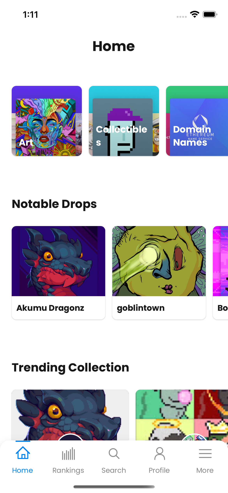

- testnets api concurrency(1000)
- cancel when de-focused

testnetst concurrency 기능을 적용했는데 일단 되긴 하는거 같은데...잘 되는건진 모르겠다.

다시 main 부분을 seciont별로 data fetch하는 것으로 바꾸었다.

card의 empty variant도 만들어서 수정하였다.

screen을 이동할 때 기존에 요청하던 fetch는 모두 취소하는 기능도 넣어야 될 것 같다.

main home을 opensea 앱 home으로 다시 수정하였다. 앱 을 벤치마킹해서 진행해야될 것 같다.

